<p align=center>
    
</p>

<p align="center">
    Data+Train+Evaluate+App 4in1 repo within the paper
<a href='README-cn.md'>[中文版]</a> <b><u>[English]</u></b>
</p>

<p align="center">
    <a href="http://opensource.org/licenses/MIT"></a>
    
    
    
    
    
</p>

This is a repository that includes Pedestrian-Detection-on-YOLOv3_Research-and-APP, a 2020 undergraduate graduation project, **ALL codes**. The graduation project which has the **Data+Train+Evaluate+App 4in1 repo** Coded and paper Wrote by Ziqiang Xu from [Jiangnan University](https://www.jiangnan.edu.cn/).


### Table of Contents

* [1\. Introduction](#1-introduction)
* [2\. Dataset](#2-dataset)
    * [2\.1 Download](#21-download)
        * [Microsoft COCO](#microsoft-coco)
        * [PASCAL VOC](#pascal-voc)
        * [INRIA Person Dataset](#inria-person-dataset)
    * [2\.2 Data distribution](#22-data-distribution)
    * [2\.3 Convert annotation format](#23-convert-annotation-format)
    * [2\.4 Batch processing](#24-batch-processing)
* [3\. YOLO Train](#3-yolo-train)
    * [3\.1 Network &amp; Loss](#31-network--loss)
    * [3\.2 Get Anchor](#32-get-anchor)
    * [3\.3 Pretrained Weights](#33-pretrained-weights)
    * [3\.4 Prepare files needed for training](#34-prepare-files-needed-for-training)
    * [3\.5 True Train process](#35-true-train-process)
    * [3\.6 Loss curve plot](#36-loss-curve-plot)
* [4\. Model Evaluation](#4-model-evaluation)
    * [4\.1 Basic metric](#41-basic-metric)
        * [4\.1\.1 Model Detection speed](#411-model-detection-speed)
        * [4\.1\.2 Model Detection quality](#412-model-detection-quality)
    * [4\.2 PR\-curve](#42-pr-curve)
    * [4\.3 Caltech MR\-FPPI](#43-caltech-mr-fppi)
        * [4\.3\.1 Extract images](#431-extract-images)
        * [4\.3\.2 predict BB for extracted images](#432-predict-bb-for-extracted-images)
        * [4\.3\.3 Evaluate by MR\-FPPI](#433-evaluate-by-mr-fppi)
    * [4\.4 Model Detection display](#44-model-detection-display)
* [5\. Web App](#5-web-app)
    * [5\.1 Keras to Darknet](#51-keras-to-darknet)
    * [5\.2 Flask Web server](#52-flask-web-server)
        * [5\.2\.1 Index](#521-index)
        * [5\.2\.2 Server Camera(remote webcam)](#522-server-cameraremote-webcam)
        * [5\.2\.3 Client Camera(local webcam)](#523-client-cameralocal-webcam)
        * [5\.2\.4 Image(online preview)](#524-imageonline-preview)
        * [5\.2\.5 Video(upload/download)](#525-videouploaddownload)
        * [5\.2\.6 Family portraits](#526-family-portraits)
* [6\. Summary](#6-summary)


## 1. Introduction

**Pedestrian Detection** is a **subset** of **Object Detection** which only have one class of **person**. It aim to find out all pedestrians in the image or video's each frame, expressed location and size with **bounding-boxes**, just like this :

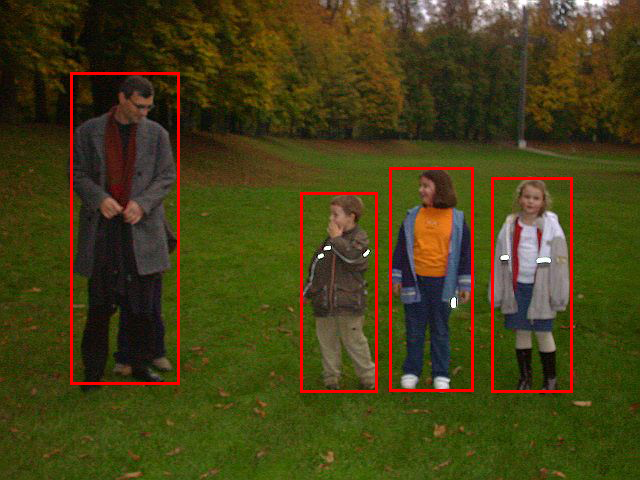

**YOLO (You Look Only Once)** is an advanced real-time object detection method. It is famous for processing images only once to get both location and classification, compared with previous object detection methods, while having similar accuracy with the state-of-the-art method, **YOLO run faster**.

This project researches Pedestrian Detection on YOLOv3 including **Data-convert,** **keras-Train**([keras-yolo3@qqwweee](https://github.com/qqwweee/keras-yolo3)) and **model-Evaluate**. Finally I also build a **Web App** base on **Flask** to realize the visualization of pedestrian detection results of the real-time webcam, image, or video (whose language is chinese, but you can easily use by following 5. Web App or just translating).

For the whole project, I use python 3.6, and for packages needed :
```bash
pip install -r requirements.txt
```


## 2. Dataset

### 2.1 Download
#### Microsoft COCO
**official link :** [http://cocodataset.org/](http://cocodataset.org/)

**Download link (2017 about 19GB) :**
```
http://images.cocodataset.org/zips/train2017.zip
http://images.cocodataset.org/zips/val2017.zip
http://images.cocodataset.org/annotations/annotations_trainval2017.zip
```

annotation just use `instances_train2017.json`+`instances_val2017.json`

#### PASCAL VOC
**official link :** [http://host.robots.ox.ac.uk:8080/pascal/VOC/](http://host.robots.ox.ac.uk:8080/pascal/VOC/)

**Download link (07+12 about 2.7GB) :**
```
https://pjreddie.com/media/files/VOCtrainval_11-May-2012.tar
https://pjreddie.com/media/files/VOCtrainval_06-Nov-2007.tar
https://pjreddie.com/media/files/VOCtest_06-Nov-2007.tar
```

after unzip just use `/JPEGImages`+`/Annotations`

**PS:** unzip `*.tar` file just like
```bash
tar xf *.tar
```

#### INRIA Person Dataset
~~**official link :** [http://pascal.inrialpes.fr/data/human/](http://pascal.inrialpes.fr/data/human/)~~ down

**Download link (about 969MB) :**

1. ~~official link : [ftp://ftp.inrialpes.fr/pub/lear/douze/data/INRIAPerson.tar](ftp://ftp.inrialpes.fr/pub/lear/douze/data/INRIAPerson.tar)~~ down

2. Baidu Cloud Disk(中文) : [https://pan.baidu.com/s/12TYw-8U9sxz9cUu2vxzvGQ](https://pan.baidu.com/s/12TYw-8U9sxz9cUu2vxzvGQ) password: jxqu

2. Google Drive : [https://drive.google.com/file/d/1wTxod2BhY_HUkEdDYRVSuw-nDuqrgCu7/view?usp=sharing](https://drive.google.com/file/d/1wTxod2BhY_HUkEdDYRVSuw-nDuqrgCu7/view?usp=sharing)

after unzip just use `/Train`+`/Test`


### 2.2 Data distribution

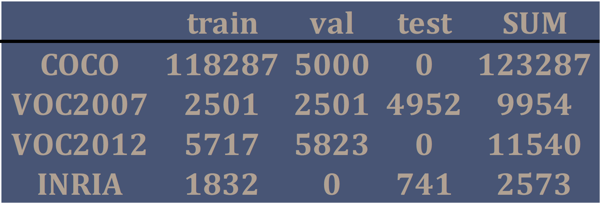

**for train & test dataset divide**

> train = (COCO train) + (VOC 07+12 train+val) + (INRIA train)
>
> test = (COCO val) + (VOC 07 test) + (INRIA test)

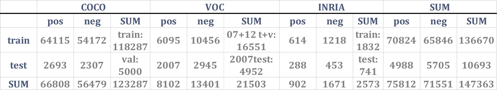

### 2.3 Convert annotation format

These dataset's annotation format is not same, so convert Ground-Truth to a Uniform format.

The train and test set are stored as a TXT file respectively, One row for One image, just like the following (without [ ]):
```bash
[image_path] [bbox1] [bbox2] [bbox3] … [bboxn]
```
bbox format:
```bash
[x_min,y_min,x_max,y_max,0]
```
PS: 0 is class id，because only one class(person), 0 is enough

For example:
```txt
./data/train/000000391895.jpg 339,22,492,322,0 471,172,506,220,0
./data/train/000000309022.jpg
./data/test/000000397133.jpg 388,69,497,346,0 0,262,62,298,0
```

### 2.4 Batch processing

For **./"2. Data"**, script are prepared individually by dataset. And the required directory structure :open_file_folder: is shown below before run python script.

```
./"2. Data"
├─COCO
│  ├─annotations
│  ├─train2017
│  └─val2017
├─VOC
│  └─VOCdevkit
│      ├─VOC2007
│      └─VOC2012
├─INRIA
|  └─INRIAPerson
|      ├─Test
|      └─Train
├─coco_annotation.py
├─voc_annotation.py
└─INRIA_annotation.py
```

All python files are append write, so run separately is ok.

```bash
python coco_annotation.py
python voc_annotation.py
python INRIA_annotation.py
```

**PS:** the script will copy images to a **new folder** (./data/train or ./data/test)

After run script, the directory structure that will be **added** in the **2. Data** folder is as follows

```
+
├─data
│  ├─train
│  └─test
├─train.txt
└─test.txt
```


## 3. YOLO Train

:white_check_mark: **Almost full copy from [keras-yolo3@qqwweee](https://github.com/qqwweee/keras-yolo3)**

By the way, `job-batch32-95gpu4.sh` is the script to submit job for training model. Just as a souvenir, do not care :)

### 3.1 Network & Loss

Here is the YOLOv3 network structure I draw for the project (by visio).

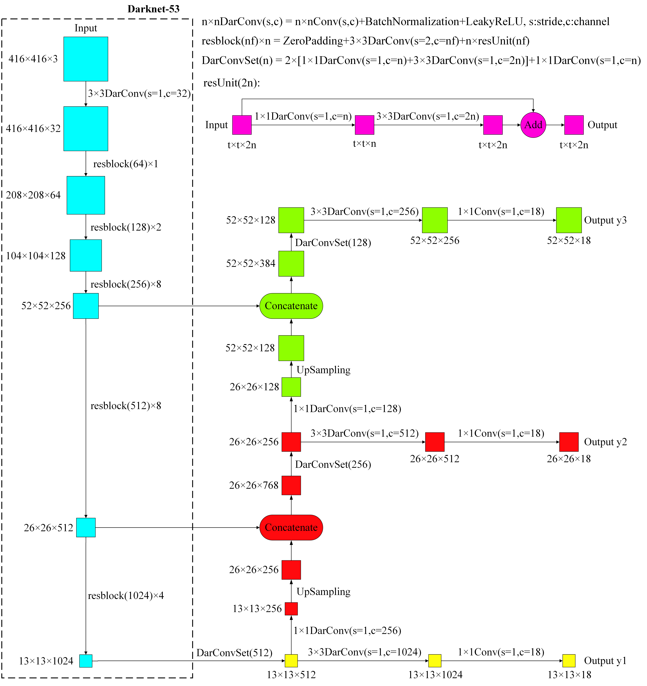

According to the codes+papers+blogs+experiments, I also conclude a loss function (for reference only).

In fact, the total loss is equal to the sum of the loss values of the 3 layer output feature map. This is the loss function of the output feature map of any layer.

<p align=center>
    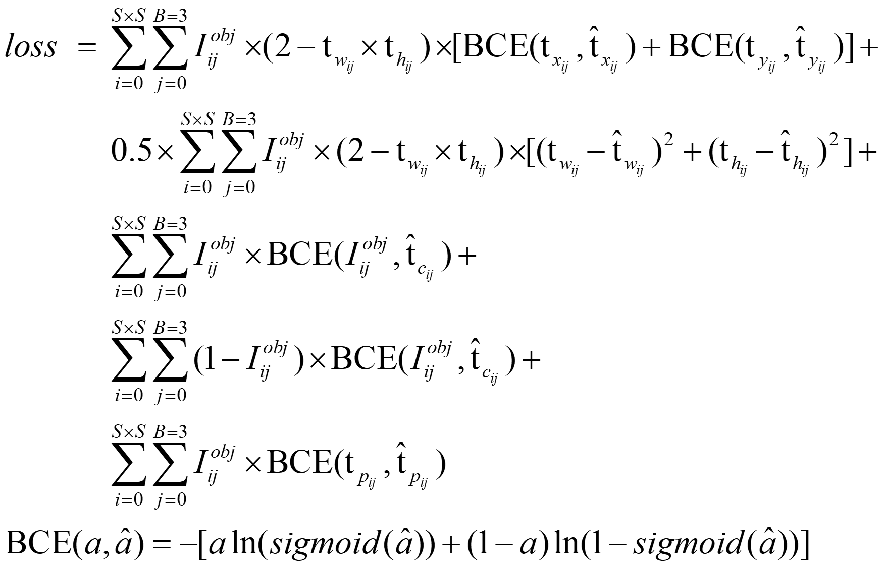
</p>


### 3.2 Get Anchor

core copy from [keras-yolo3/kmeans.py@qqwweee](https://github.com/qqwweee/keras-yolo3/blob/master/kmeans.py), just ADD **visualization**

Before get anchors, that require train dataset Ground-Truth file (default `train.txt`) from [2\.4 Batch processing](#24-batch-processing)

```bash
python anchor_kmeans.py
```

After run script, the directory structure that will be **added** in the **3. Train** folder is as follows

```
+
├─Anchors-by-Kmeans.png
├─yolo_anchors.txt
└─kmeans.npy
```

`Anchors-by-Kmeans.png` is the visualization picture file.
`yolo_anchors.txt` is exactly the file to store the anchors needed for training.
`kmeans.npy` stores the Kmeans result, it helps to avoid repeated Kmeans when changing the visualization style.


Here is one of the anchors with relatively high accuracy, which is 65.81%, and it's also the train anchors I used. (Accuracy is the average value of IOU of each boundary-box and clustering center. The larger it is, the better the clustering effect of k-means will be.)
```
Anchors: (6,11), (12,22), (19,40), (33,65), (49,132), (68,81), (94,189), (170,287), (335,389)
```

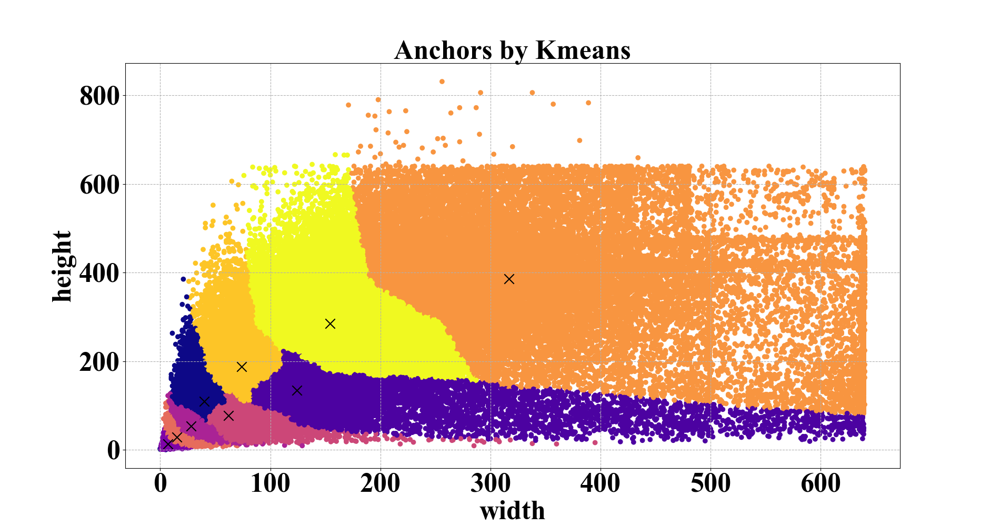

### 3.3 Pretrained Weights

follow [keras-yolo3@qqwweee/README.md](https://github.com/qqwweee/keras-yolo3/blob/master/README.md)

1\. Download YOLOv3 pre-trained weight file [here (237 MB)](https://pjreddie.com/media/files/yolov3.weights) from [YOLO website](https://pjreddie.com/darknet/yolo/). Or just run this:
```bash
wget https://pjreddie.com/media/files/yolov3.weights
```
2\. Convert the Darknet YOLO model weights(\*.cfg+\*.weights) to a Keras model weights(\*.h5).

```bash
python convert_yolov3_weight_darkent2keras.py -w yolov3.cfg yolov3.weights yolo_weights.h5
```

### 3.4 Prepare files needed for training

1\. create class file(`person_classes.txt`), each line is a class name, so just fill in one line: **person**.
```bash
vi person_classes.txt
```
2\. make a folder (`model_data`) place configuration file and pretrained weights.
```bash
mkdir model_data
```
3\. move  `person_classes.txt`, `yolo_anchors.txt` and `yolo_weights.h5` to `model_data`.
```bash
mv person_classes.txt yolo_anchors.txt yolo_weights.h5 ./model_data
```

### 3.5 True Train process

Before training, don't forget move train dataset (`/data/train`) and image_path+annotation file (`train.txt`) from [2\.4 Batch processing](#24-batch-processing) to current directory (`3. Train`)

And then use [keras-yolo3@qqwweee/train.py](https://github.com/qqwweee/keras-yolo3/blob/master/train.py)'s default Train config, just save a weights per 10 epoch.

For train&val, All training data(`train.txt`) are shuffled randomly, and divide train:val = 9:1.

For 1 training stage, Train with frozen layers first, to get a stable loss.

1. freeze all but 3 output layers
2. optimizer=Adam()
3. learning_rate=1e-3
4. epochs=50

For 2 training stage, Unfreeze and continue training, to fine-tune.

1. Unfreeze all of the layers
2. optimizer=Adam()
3. learning_rate=1e-4
4. epochs=300-50
5. reduce_lr: When val_loss does not decrease for 3 epoch, the learning rate is reduced by 10% each time.
6. early_stopping: When val_loss does not decrease for 10 epochs, the training is stopped early.

Now we can finally train !!!
```bash
python train.py
```

For the model I trained, I push it on `pan.baidu.com` and `drive.google.com`, it's a weight that has been trained 109 epochs.(235.4MB)

Download link:

1. Baidu Cloud Disk(中文) : [https://pan.baidu.com/s/130J8c5B9RQILSDKAFKyK1A](https://pan.baidu.com/s/130J8c5B9RQILSDKAFKyK1A) password: wmht

2. Google Drive : [https://drive.google.com/file/d/1zxcpjklHKQ6hULa8HmeKIQqnkH_h_NSI/view?usp=sharing](https://drive.google.com/file/d/1zxcpjklHKQ6hULa8HmeKIQqnkH_h_NSI/view?usp=sharing)

### 3.6 Loss curve plot

The log was stored through the TensorBoard while training. So, just extract the log of loss and draw the loss curve.

The first parameter is the path to log of the first 50 epochs. The second parameter is the path to the rest of log after 50 epochs.

**NOTE:** Pay attention to the order

```bash
python Tensorboard_log_loss_visualization.py \
    logs/batch32/events.out.tfevents.1586104689.r1cmpsrvs79-14ig0702 \
    logs/batch32/events.out.tfevents.1586671921.r1cmpsrvs79-14ig0702
```

Here is the loss curve plot I trained model, it's 1 to 109 because it stopped early after 109 epoch. Finally, loss=9.05, val_loss=9.54.

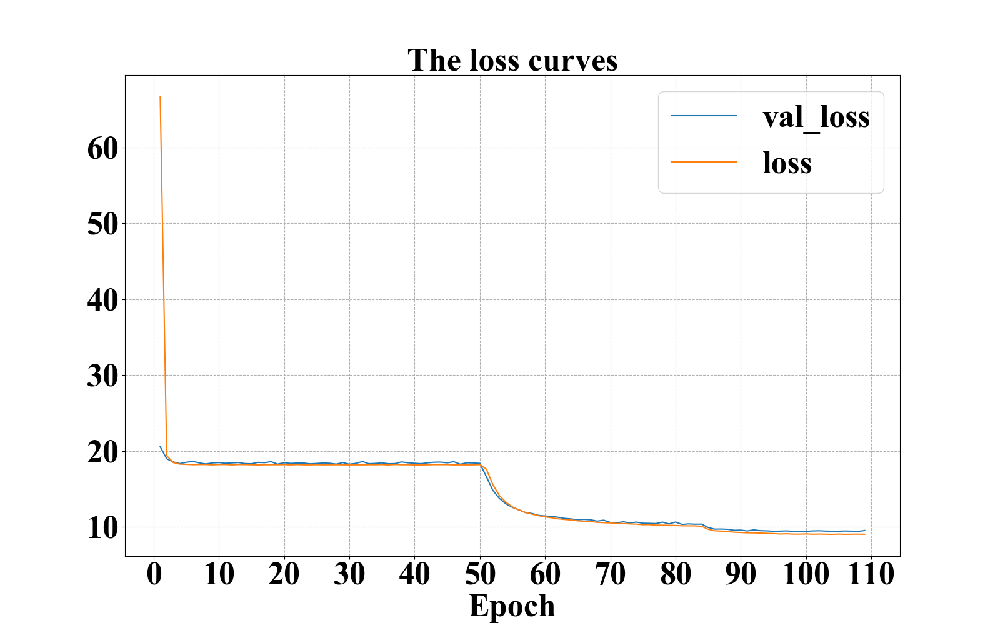


## 4. Model Evaluation

Before Evaluating, require move test dataset (`/data/test`) and image_path+annotation file (`test.txt`) from [2\.4 Batch processing](#24-batch-processing) to current folder (`4. Evaluate`)

And of course, You need to make sure that the model weights([3\.5 True Train process](#35-true-train-process)) are in the `4. Evaluate/model/` folder, default name: `trained_weights_final.h5`

**NOTE:** **Using PASCAL metric, (predict bounding_boxes and Ground_Truth)'s IOU > 0.5 is good, to evaluate the detector. And filter box score is 0.3, NMS threshold is 0.45.**


### 4.1 Basic metric

speed : average+max+min second per image, each image's time it takes

quality :

1. exactly correct image number
2. error image number
3. missing image number
4. Error&Missing image number
5. Ground Truth number
6. prediction bounding-box number
7. number of correct prediction(good detection bounding-box)
8. Precision
9. Recall


**Put ALL in `testSet_eva.py`**

`testSet_eva.py`'s main func call func `evaluate()`, which has two parameters:

1. `IsVsImg` : Whether to draw Ground-Truth and predict BB(bounding-box) together on the image and store new image to a new location(`4. Evaluate/test_eval/vs/`)
2. `IsErrorMissingCorrect` : Whether to copy the **missing, error, correct** image(with GT&pred_BB) to the new location and record the information to a TXT file(`4. Evaluate/test_eval/ErrorMissingCorrect.txt`)

If IsVsImg==False and IsErrorMissingCorrect==False: will only print and save basic metric test result without getting any resulting images

default : `IsVsImg=True,IsErrorMissingCorrect=True`

The program will store the predict BB results, so you can run again without repeating predictions.

```bash
python testSet_eva.py
```

After run script, the directory structure that will be **added** in the **4. Evaluate** folder is as follows

```
+
└─test_eval
   ├─correct
   │  └─...
   ├─error
   │  └─...
   ├─missing
   │  └─...
   ├─vs
   │  └─...
   ├─ErrorMissingCorrect.txt
   ├─Ground_Truth.npy
   ├─predict_bb.npy
   └─pre_bb_sec.npy
```

`vs` include all test set images with drawing Ground-Truth and predict bounding-box together.

`correct` is the exactly correct image(with GT&pred_BB) folder. `error` is the image(with GT&pred_BB) folder where image includes error prediction BB. `missing` is the image(with GT&pred_BB) folder where image includes missing prediction BB. `ErrorMissingCorrect.txt` stores missing, error, correct images info(including pred_num, gt_num, good_num)

`Ground_Truth.npy` stores the Ground_Truth results, which helps to avoid repeated Ground_Truth extracted when runing again. `predict_bb.npy` is the prediction BB results file, which helps run again without repeating predictions.

`pre_bb_sec.npy` stores each image's time it takes to process.


#### 4.1.1 Model Detection speed

Draw the run-time statistics, and the parameter(`-p` or `-pre_bb_sec_file`) is the path to the file of each image's seconds it takes to process prediction bounding-box.(`default='test_eval/pre_bb_sec.npy'`)

```bash
python run_time_statistics.py -p test_eval/pre_bb_sec.npy
```

Here is the statistics of image number of run-time range on the test set([2\.2 Data distribution](#22-data-distribution)) by the trained model([3\.5 True Train process](#35-true-train-process)). By the way, GPU is a `NVIDIA Tesla V100 SXM2 32GB`.

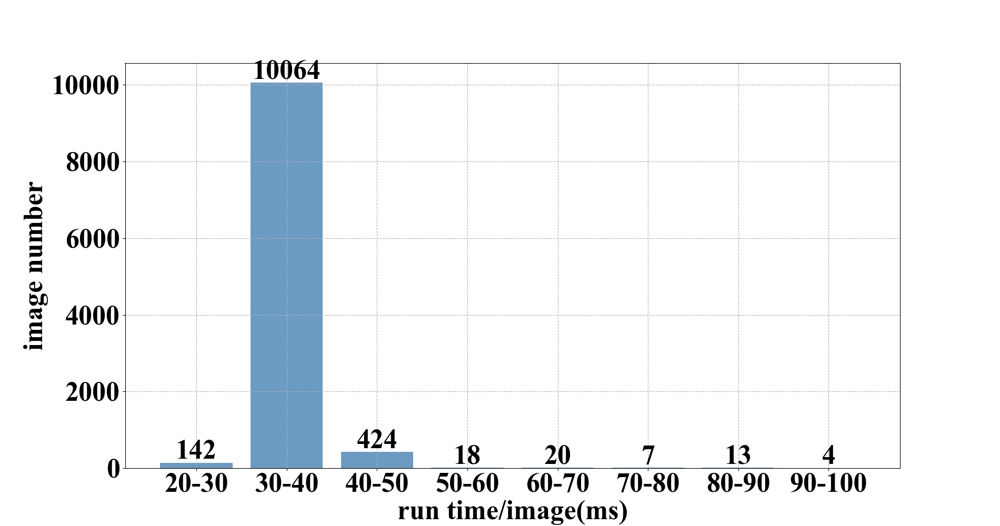

Don't care first image for Keras loading, it take about 3.2s >> others, remove it. So, there are total 10692 images, max=95ms, min=28ms, average=34ms ≈ 29fps, and 30-40ms is the most: 94%.


#### 4.1.2 Model Detection quality

For `testSet_eva.py`'s print, there are some results to share.

There are total 10693 test images. At the level of images, display as following.

|                  | correct | error | missing | Error&Missing |
|------------------|---------|-------|---------|---------------|
| **image number** | 8234    | 1545  | 1798    | 884           |
| **percent**      | 77%     | 14%   | 17%     | 8%            |

At the level of bounding-box, there are 16820 Ground Truth, predictions bounding_boxes number is 15339 and the number of correct(good) prediction is 12160. Finally, precision and recall and so on are shown in the following table.

| Precision | Recall | Error Rate | Miss Rate |
|-----------|--------|------------|-----------|
| 79.28%    | 72.29% | 20.72%     | 27.72%    |


### 4.2 PR-curve

Using the PR curve drawing tool and AP computing tool provided by [Object-Detection-Metrics@rafaelpadilla](https://github.com/rafaelpadilla/Object-Detection-Metrics).

**PS:** Only modify the plot and savePath part.

First, we need to prepare the ground truth bounding boxes files and detected bounding boxes files(score=0) according to [Object-Detection-Metrics/README.md#how-to-use-this-project@rafaelpadilla](https://github.com/rafaelpadilla/Object-Detection-Metrics#how-to-use-this-project)'s request.
```bash
python testSet_PR_AP_raw_bb_data.py
```
After run script, the directory structure that will be **added** in the **4. Evaluate** folder is as follows

```
+
└─PRcurve_AP_raw_bb_data
   ├─gt
   │  └─...
   └─pre
      └─...
```

And then we can plot PR-curve and compute AP.
```bash
python pascalvoc.py -gt ./PRcurve_AP_raw_bb_data/gt -det ./PRcurve_AP_raw_bb_data/pre -sp ./PR_AP_results
```
After run script, the directory structure that will be **added** in the **4. Evaluate** folder is as follows

```
+
└─PR_AP_results
   ├─person.png
   └─results.txt
```

`person.png` is the PR-curve image. `results.txt` includes AP computed result.

Here is the PR-curve for the trained model on test set. And its AP is 85.80%.

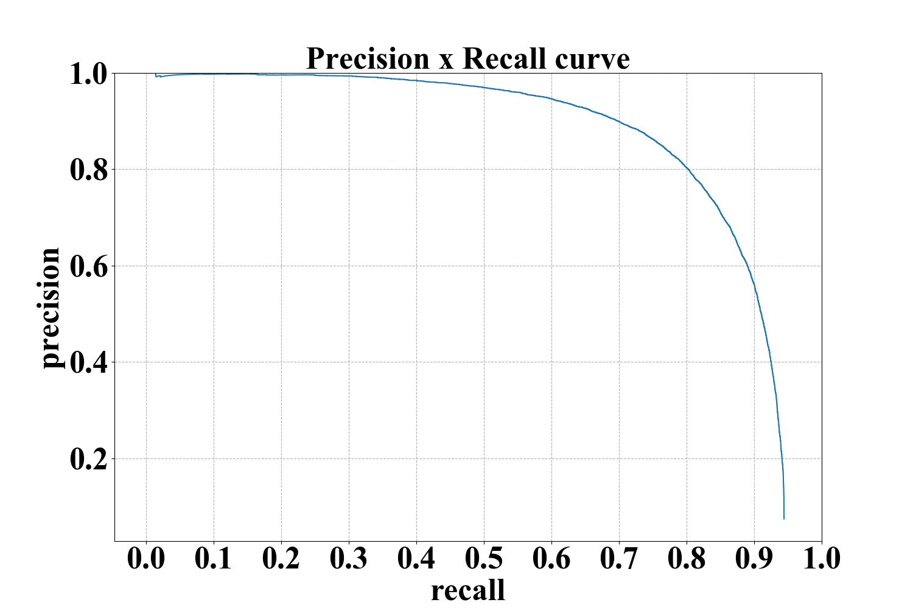

### 4.3 Caltech MR-FPPI

**official link :** [http://www.vision.caltech.edu/Image_Datasets/CaltechPedestrians/](http://www.vision.caltech.edu/Image_Datasets/CaltechPedestrians/)

In the case that the training set of the model does not contain the pictures in the Caltech dataset, make predictions on its test set, use the matlab tool provided by Caltech to draw the MR-FPPI curve, and download other algorithm test results for comparison.

The following workflow main copy from [https://blog.csdn.net/qq_33614902/article/details/82622561](https://blog.csdn.net/qq_33614902/article/details/82622561) 中文 and [https://www.jianshu.com/p/6f3cf522d51b](https://www.jianshu.com/p/6f3cf522d51b) 中文

#### 4.3.1 Extract images

**Caltech person dataset download link :** [http://www.vision.caltech.edu/Image_Datasets/CaltechPedestrians/datasets/USA/](http://www.vision.caltech.edu/Image_Datasets/CaltechPedestrians/datasets/USA/)

The testing data (set06-set10) consists of five sets, ~1GB each.


```
# download toolbox
git clone https://github.com/pdollar/toolbox pdollar_toolbox

# download extract/evaluation code
wget http://www.vision.caltech.edu/Image_Datasets/CaltechPedestrians/code/code3.2.1.zip
mkdir code
unzip code3.2.1.zip -d code

# for video data
cd code
mkdir data-USA
cd data-USA
mkdir videos
```

move testing data (set06-set10) after decompression to `code/data-USA/videos`.

open `code/dbExtract.m`, add Toolbox path.

```bash
addpath(genpath('../pdollar_toolbox'));
```

And then just run `code/dbExtract.m` to get test images in `code/data-USA/images`.

#### 4.3.2 predict BB for extracted images

```bash
python Caltech_predict_BB.py
```
After run script, the directory structure that will be **added** in the **4. Evaluate/code/data-USA/** folder is as follows

```
+
└─res
   └─YOLOv3
      ├─set06
      │  └─...
      ├─set07
      │  └─...
      ├─set08
      │  └─...
      ├─set09
      │  └─...
      └─set10
         └─...
```

`set06~set10` is the result folder of the prediction bounding-box according to the official requirements. Relative to the location of the image to store a prediction result TXT file with the same name, which include one bounding box per line. (line format is `[x_min,y_min,width,height,score]`)

#### 4.3.3 Evaluate by MR-FPPI

```bash
# download annotations
wget http://www.vision.caltech.edu/Image_Datasets/CaltechPedestrians/datasets/USA/annotations.zip
unzip annotations.zip
```

move `annotations/` to `4. Evaluate/code/data-USA/`.

Download other Algorithm's results to compare. link: [http://www.vision.caltech.edu/Image_Datasets/CaltechPedestrians/datasets/USA/res](http://www.vision.caltech.edu/Image_Datasets/CaltechPedestrians/datasets/USA/res)

After download, move these results to `4. Evaluate/code/data-USA/res/` too.

Finally, we can run `part_algo-not_pdf-dbEval.m`. (select some algorithms and fix it work without Ghostscript and pdfcrop)

Here is the result to share. On the Caltech Reasonable test set, the YOLOv3 MR reached 19% when FPPI=0.1. Without training Caltech data, such result is not bad.

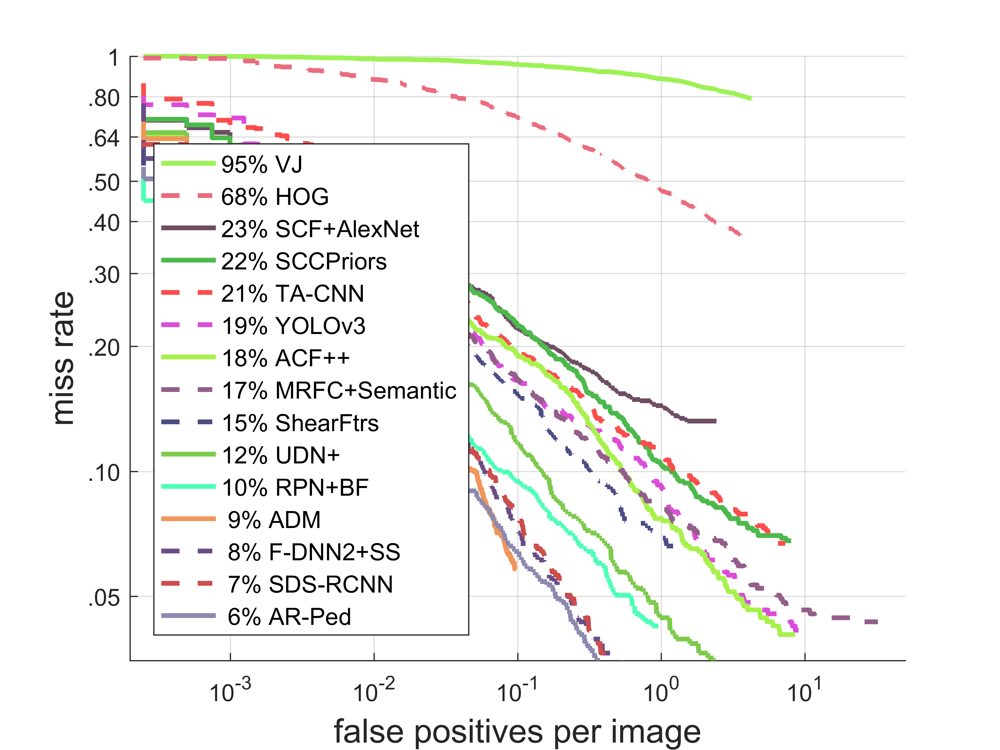


### 4.4 Model Detection display

Prediction bounding-box: red | Ground-Truth: green

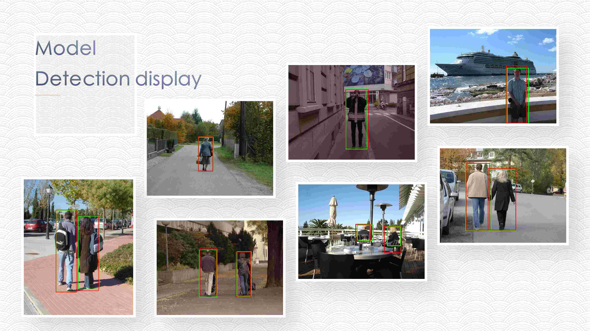
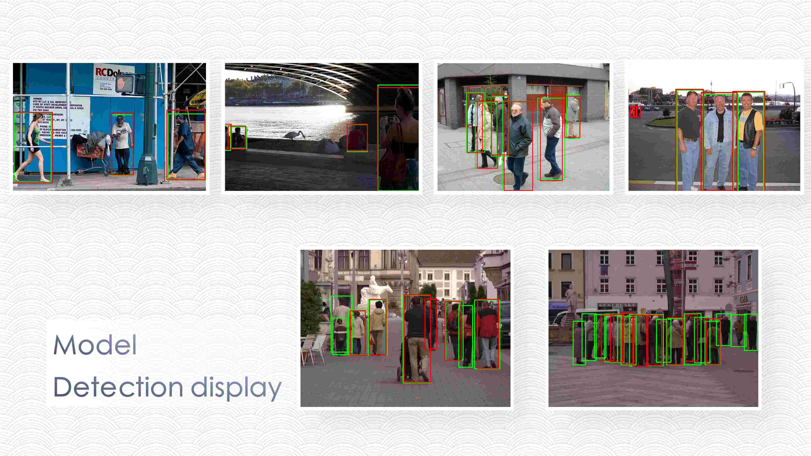
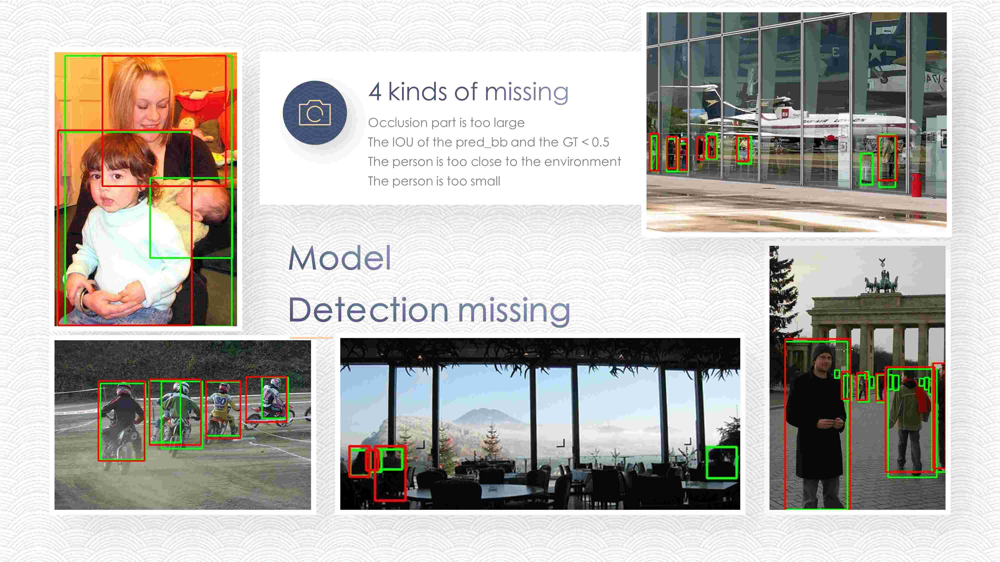
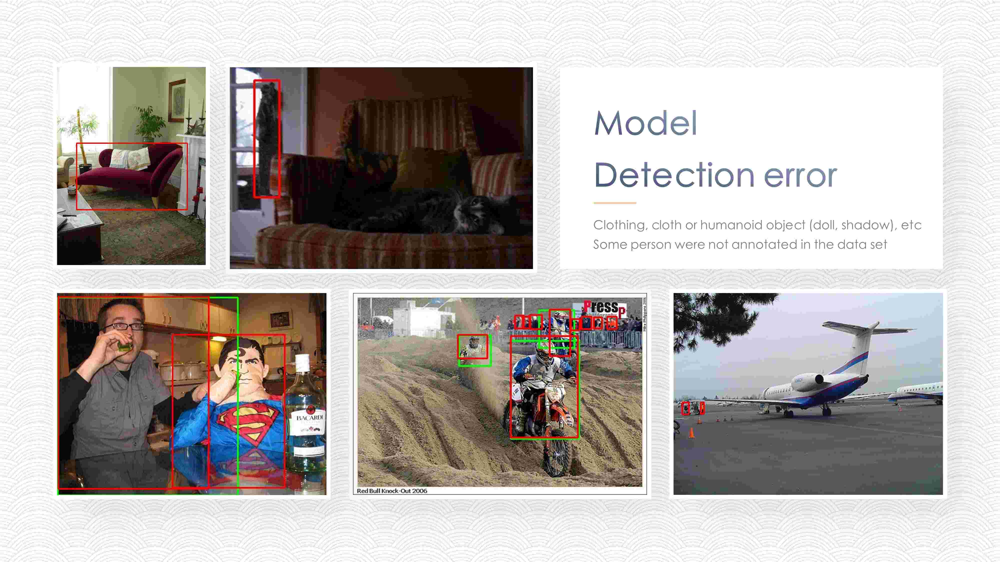


## 5. Web App

:bangbang: **NOTE: The Web App currently only allows one client to access!!!**

Development Environment:

1. OS: Microsoft Windows 10 Home --version 10.0.18363
2. CPU: Intel(R) Core(TM) i7-8550U CPU@1.80GHz 1.99 GHz
3. Memory: 8.00GB
4. GPU: Interl(R) UHD Graphics 620 (Core graphics card)

**NOTE:** For no discrete graphics card, run keras slow, which takes 3~5s to process one image. It is unbearable in development and debugging, so I convert Keras weights to cpu-friendly Darkent format.

### 5.1 Keras to Darknet

```bash
cd "keras2darknet_&_simpleEvaluate"
```
Before convert, we get weights rather than model from Train, so we change weights(`trained_weights_final.h5`) to model(`trained_model_final.h5`) first.

And of course, You need to make sure that the model weights([3\.5 True Train process](#35-true-train-process)) are in the `5. App/keras2darknet_&_simpleEvaluate/model/` folder, default name: `trained_weights_final.h5`
```bash
python keras-yolo3_weights2model.py
```
After runing, you will get `trained_model_final.h5` in the `model/` directory.

And then, let's convert. `model/yolo-person.cfg` is altered from `yolov3.cfg`, which only modify anchors and last convolutional filters to fit the project.
```bash
python keras2darknet.py
```
After runing, you will get converted Darknet weights (`yolov3-keras2darknet.weights`) in the `model/` directory.

Now, just do some sample evaluation.

move test dataset (`/data/test`) and image_path+annotation file (`test.txt`) from [2\.4 Batch processing](#24-batch-processing) to current folder (`5. App/keras2darknet_&_simpleEvaluate/`)
```bash
python testSet_darknet-out-model_eva.py
```
`testSet_darknet-out-model_eva.py` is almost exactly the same with `4. Evaluate/testSet_eva.py`. The only difference is that `testSet_darknet-out-model_eva.py` use `yolov3_opencv_dnn_detect.py` to predict bounding-box, but the interface is the same.

Here are some results to share.

There are total 10693 images, max=2.02s, min=0.98s, average=1.47s ≈ 0.68fps. It is much faster than Keras running on a computer without a independent GPU.

For quality, at the level of 10693 images, display as following.

|             |  correct  |   error   |  missing  | Error&Missing |
|-------------|-----------|-----------|-----------|---------------|
| **Keras**   | 8234(77%) | 1545(14%) | 1798(17%) | 884(8%)       |
| **Darknet** | 8206(77%) | 1579(15%) | 1840(17%) | 932(9%)       |

At the level of bounding-box, there are 16820 Ground Truth, predictions bounding_boxes number is 15183 and the number of correct(good) prediction is 12101. Finally, precision and recall and so on are shown in the following table.

|             | Precision | Recall | Error Rate | Miss Rate |
|-------------|-----------|--------|------------|-----------|
| **Keras**   | 79.28%    | 72.29% | 20.72%     | 27.72%    |
| **Darknet** | 79.70%    | 71.94% | 20.30%     | 28.06%    |


In terms of these two level quality metrics, the detection effect of the converted model is few different from that of the original model, so it can be used.

### 5.2 Flask Web server

```bash
cd server
```

Of course, You need to make sure that the model weights([5\.1 Keras to Darknet](#51-keras-to-darknet)) are in the `5. App/server/model/` folder, default name: `yolov3-keras2darknet.weights`.

**PS:**

1. I also provided the keras detection file `keras_yolov3_detect.py`. If you would like to detect by keras, please make sure the model weights([3\.5 True Train process](#35-true-train-process)) are in the `5. App/server/model/` folder, default name: `trained_weights_final.h5` and modify `config.ini`'s `detection_method` from `darknet` to `keras`.
2. If you want to run without detecting person, please modify `config.ini`'s `detect_person` from `true` to `false`.


Now, let's run the server.

```bash
python runserver.py
```
use `IP:port`(xx.xx.xx.xx:5000) or just [localhost:5000](http://localhost:5000) to access the web app.

**PS:** If access by `IP:port`, you have to add your `IP` to `ip_white_list.yml`, OR directly change `config.ini`'s `use_ip_white_list` to `false`.


#### 5.2.1 Index

There are 4 functions in it.

1. Server Camera(remote webcam)
2. Client Camera(local webcam)
3. Image(online preview)
4. Video(upload/download)

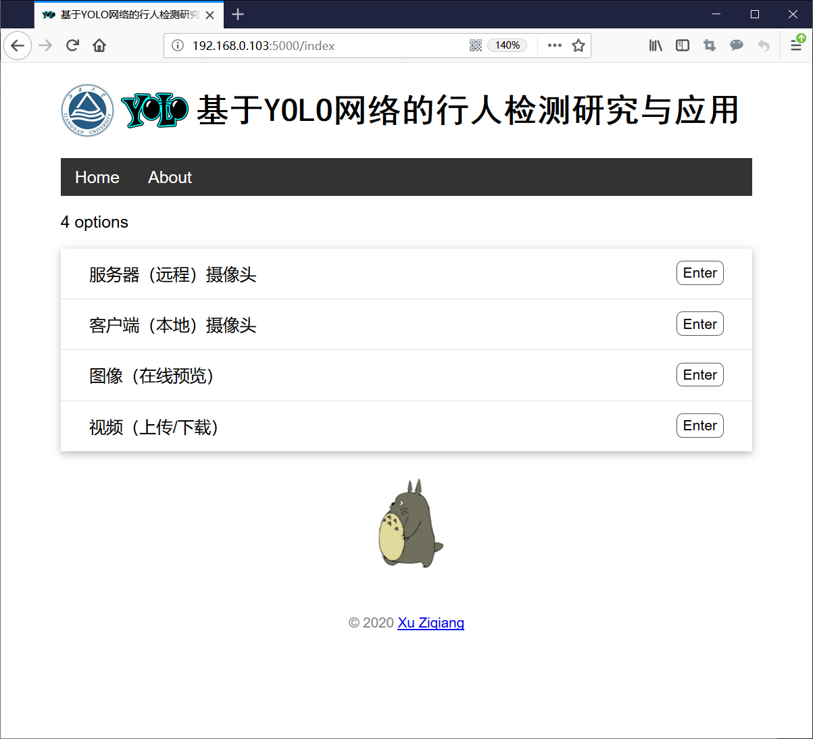

#### 5.2.2 Server Camera(remote webcam)

This page you can choose server camera. On my computer running the server, there are 2 cameras.

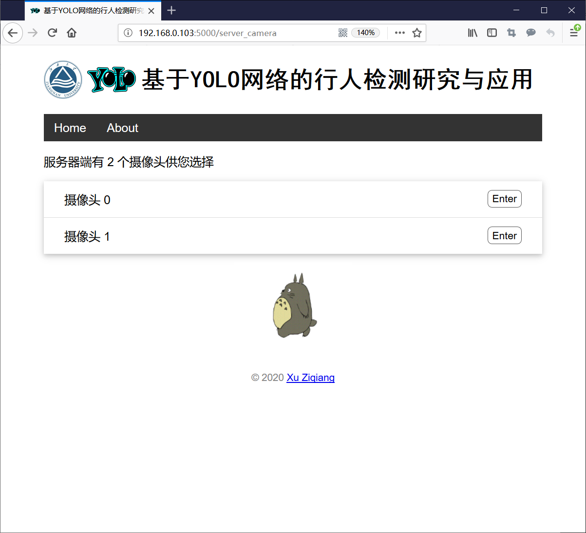

click to enter anyone, you would see like this:

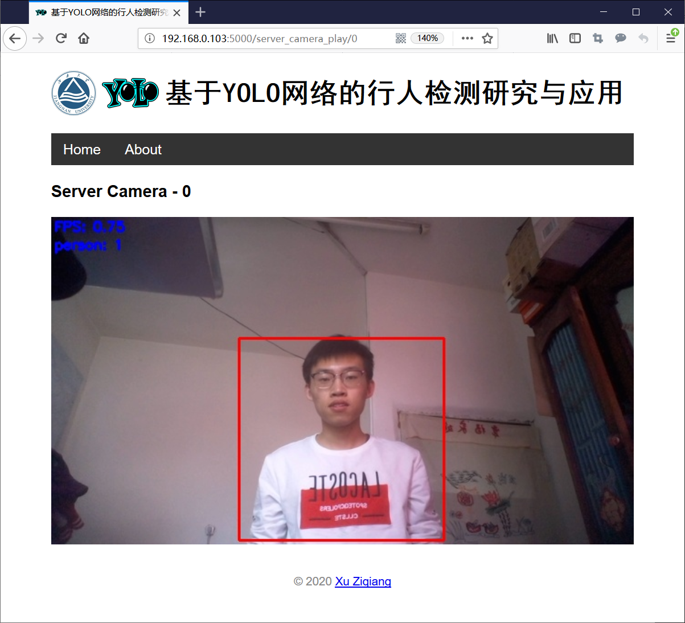

#### 5.2.3 Client Camera(local webcam)

The second option is client camera, there are 3 method to realize, see code for details :stuck_out_tongue:.

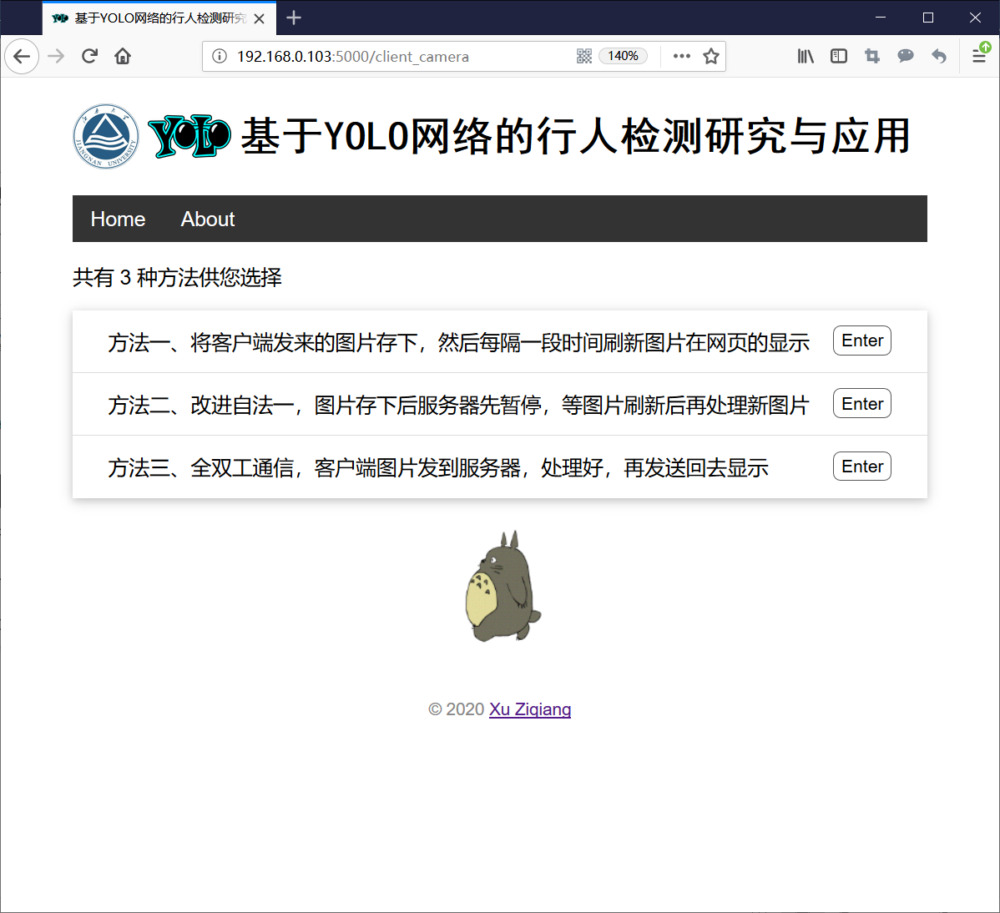

For only one camera on the client.

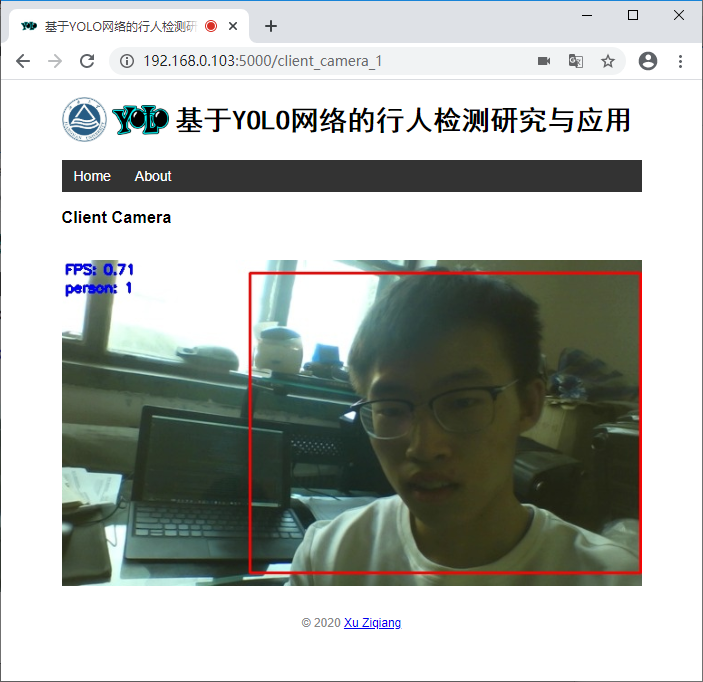

For multiple cameras on the client device.


#### 5.2.4 Image(online preview)

Original web page

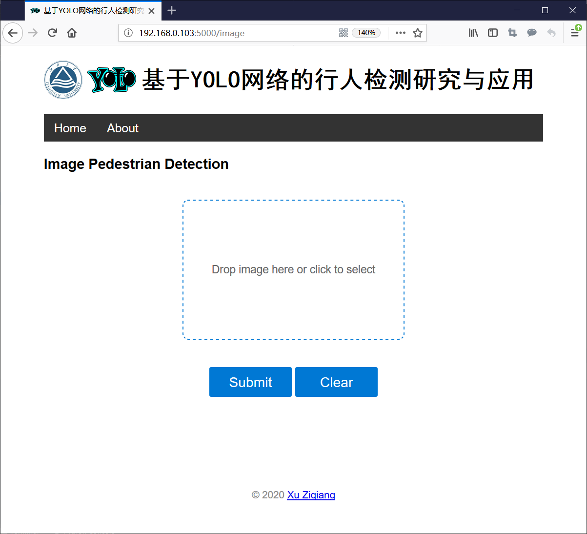

Drop and Submit

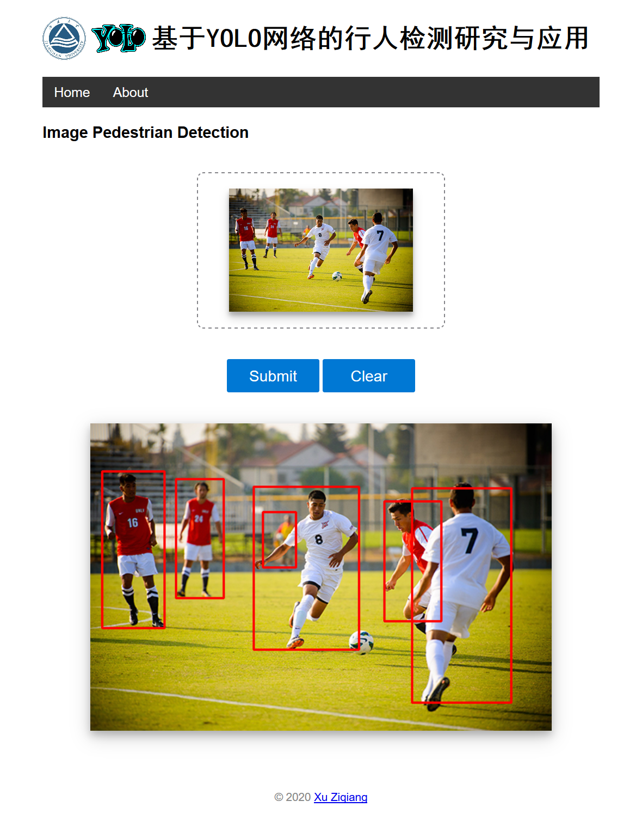


#### 5.2.5 Video(upload/download)

Initial

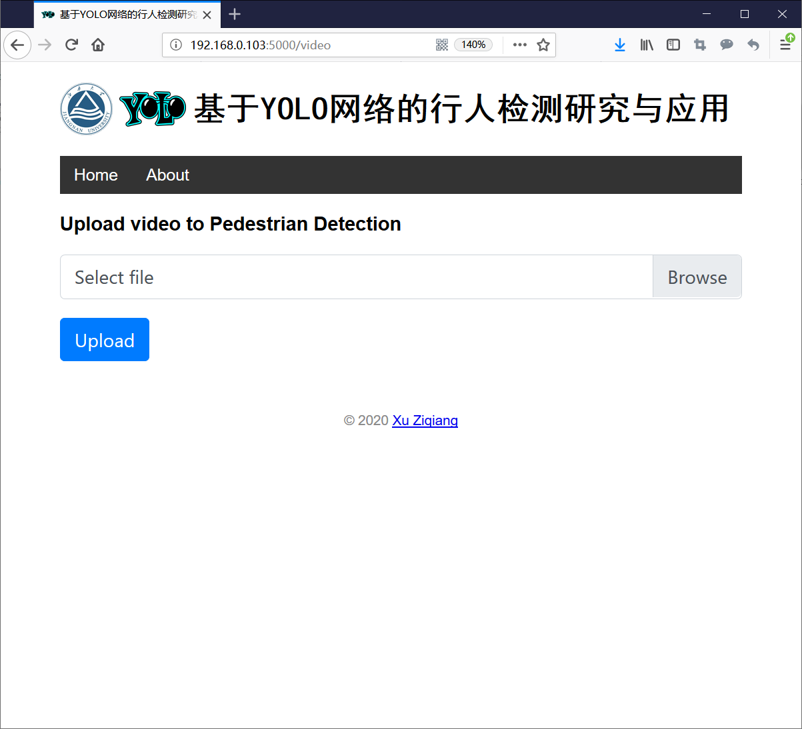

After processing done

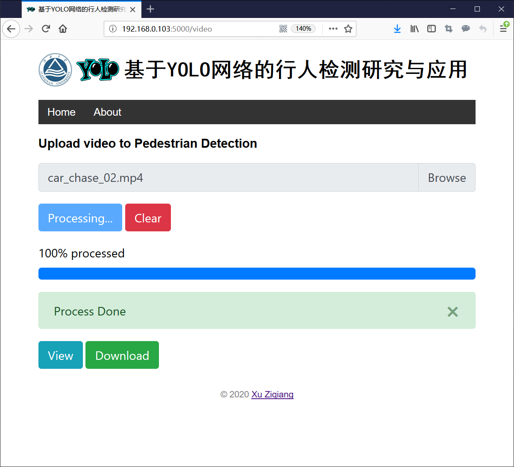

#### 5.2.6 Family portraits

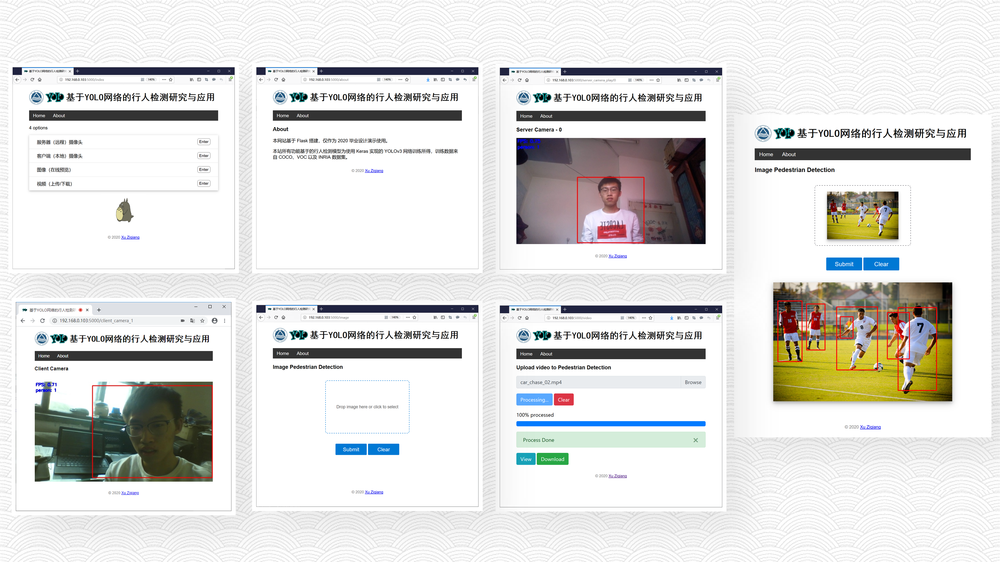


## 6. Summary

The project has a detailed README and reproducible codes which takes two weeks to organize them.

This project researches Pedestrian Detection on YOLOv3. A lot of references to others' code, thanks here. Whether **Data-convert,** **keras-Train** or **model-Evaluate** and **Web App**, I did the best I could and they all constitute my 3 months life.

The university is about to end, I will also enter a new life, I wish myself a bright future~~

<p align="center">
    
</p>