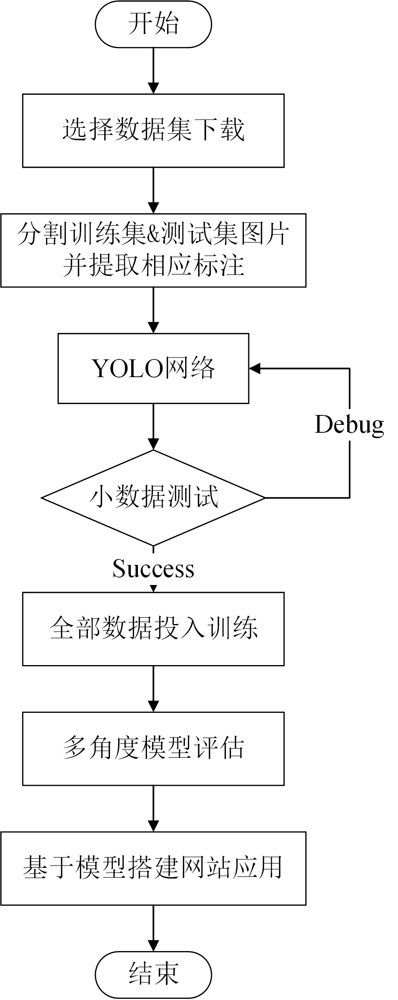

    

    Data+Train+Evaluate+App 4in1 repo within the paper
<a href='README.md'>[中文版]</a> <a href='README-en.md'>[English(TODO)]</a>

This is a repository that includes Pedestrian-Detection-on-YOLOv3_Research-and-APP, a 2020 undergraduate graduation project, **ALL codes**. The graduation project which has the **Data+Train+Evaluate+App 4in1 repo** Coded and paper Wrote by Ziqiang Xu from [Jiangnan University](https://www.jiangnan.edu.cn/).

### Table of Contents
- <a href='#1-Introduction'>1. Introduction</a>
- <a href='#2-Data'>2. Data</a>
- <a href='#3-YOLO-Train'>3. YOLO Train</a>
- <a href='#4-Model-Evaluation'>4. Model Evaluation</a>
- <a href='#5-Web-App'>5. Web App</a>
- <a href='#6-Summary'>6. Summary</a>

## 1. Introduction

行人检测是目标检测中的一个经典问题，它要解决的问题是：找出图像或视频帧中所有的行人，包括位置和大小，用矩形框表示。

YOLO (You Look Only Once) 算法是一种先进的实时目标检测方法，它以只处理一次图片同时得到位置和分类而得名，速度快且结构简单。

本项目在对YOLO算法研究的基础上，在行人数据集上进行实验，最终依据训练好的模型设计一个行人检测应用。

具体工作流程如下：

首先查找选择下载并收集整理行人数据集，将所有数据分割出训练集和测试集，然后提取每张图片的标注并统一格式。

之后基于 **Keras** 实现的 **YOLOv3** 网络（[keras-yolo3@qqwweee](https://github.com/qqwweee/keras-yolo3)），对其进行一定的调整以适合行人检测问题。根据数据集标注使用 **K-means聚类** 确定出 9 个先验框（anchor），并基于 anchors 将全部训练数据投入训练。当然，期间存在小数据 Debug 的过程。

然后对训练完成得到的最终模型进行多种评估测试，并将它与其他算法模型进行对比分析。

最终，依据训练好的模型基于 **Flask** 设计搭建一个行人检测网站应用实例，实现对输入的实时视频流（摄像头）、静态图像或视频的行人检测结果的可视化。

## 2. Data

### COCO
下载 2017 版 约 19G，下载链接：

训练集： [http://images.cocodataset.org/zips/train2017.zip](http://images.cocodataset.org/zips/train2017.zip)

验证集： [http://images.cocodataset.org/zips/val2017.zip](http://images.cocodataset.org/zips/val2017.zip)

训练集验证集注释： [http://images.cocodataset.org/annotations/annotations_trainval2017.zip](http://images.cocodataset.org/annotations/annotations_trainval2017.zip)

## 3. YOLO Train

## 4. Model Evaluation

## 5. Web App

## 6. Summary