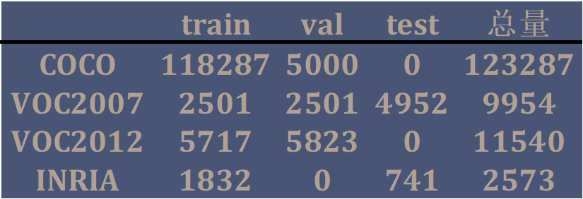
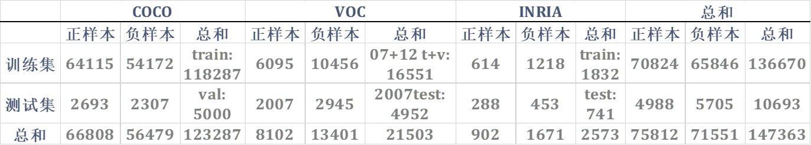

<p align=center>
    
</p>

<p align="center">
    Data+Train+Evaluate+App 4in1 repo within the paper
<a href='README-cn.md'>[中文版（TODO）]</a> <u><b>[English]</b></u>
</p>

<p align="center">
    

    
    

    
    

    
</p>

This is a repository that includes Pedestrian-Detection-on-YOLOv3_Research-and-APP, a 2020 undergraduate graduation project, **ALL codes**. The graduation project which has the **Data+Train+Evaluate+App 4in1 repo** Coded and paper Wrote by Ziqiang Xu from [Jiangnan University](https://www.jiangnan.edu.cn/).


### Table of Contents
- <a href='#1-Introduction'>1. Introduction</a>
- <a href='#2-Dataset'>2. Dataset</a>
- <a href='#3-YOLO-Train'>3. YOLO Train</a>
- <a href='#4-Model-Evaluation'>4. Model Evaluation</a>
- <a href='#5-Web-App'>5. Web App</a>
- <a href='#6-Summary'>6. Summary</a>


## 1. Introduction

**Pedestrian Detection** is a **subset** of **Object Detection** which only have one class of **person**. It aim to find out all pedestrians in the image or video's each frame, expressed location and size with **bounding-boxes**, just like this:


**YOLO (You Look Only Once)** is an advanced real-time object detection method. It is famous for processing pictures only once to get both location and classification, compared with previous object detection methods, while having similar accuracy with the state-of-the-art method, **YOLO run faster**.

This project research Pedestrian Detection on YOLOv3 including **Data-convert,** **keras-Train**([keras-yolo3@qqwweee](https://github.com/qqwweee/keras-yolo3)) and **model-Evaluate**. Finally I also build a **Web App** base on **Flask** to realize the visualization of pedestrian detection results of the real-time webcam, image, or video.


## 2. Dataset

选择后下载的共 4 个数据集： Microsoft 的 COCO 数据集、PASCAL 的 VOC 数据集、INRIA 行人数据集以及 Caltech 行人数据集，前 3 个用于训练和基础测试，Caltech 用于和其他算法模型比较，实验（代码测试）使用的是 INRIA 和 VOC07。需要说明的是 COCO 和 VOC 包含多类别甚至多方向，只使用其中的 **person** 类的 **目标检测** 部分注释。而 Caltech 数据集仅用于比较，未多做研究，稍具体的操作将在 **4. Model Evaluation** 中说明。

### 2.1 Download+Unzip
#### COCO

**官网：** [http://cocodataset.org/](http://cocodataset.org/)

下载 2017 版 约 19GB，下载链接：

训练集： [http://images.cocodataset.org/zips/train2017.zip](http://images.cocodataset.org/zips/train2017.zip)

验证集： [http://images.cocodataset.org/zips/val2017.zip](http://images.cocodataset.org/zips/val2017.zip)

训练集+验证集注释： [http://images.cocodataset.org/annotations/annotations_trainval2017.zip](http://images.cocodataset.org/annotations/annotations_trainval2017.zip) （其中前缀为 instances 的 json 文件中包含目标检测的注释）

#### PASCAL VOC

**官网：** [http://host.robots.ox.ac.uk:8080/pascal/VOC/](http://host.robots.ox.ac.uk:8080/pascal/VOC/)

以下是 YOLO 原作者提供的下载链接，下载 07 和 12 版，大约 2.7GB。

```bash
wget https://pjreddie.com/media/files/VOCtrainval_11-May-2012.tar
wget https://pjreddie.com/media/files/VOCtrainval_06-Nov-2007.tar
wget https://pjreddie.com/media/files/VOCtest_06-Nov-2007.tar
```

解压：
```bash
tar xf VOCtrainval_11-May-2012.tar
tar xf VOCtrainval_06-Nov-2007.tar
tar xf VOCtest_06-Nov-2007.tar
```

解压后的文件夹中 ‘/JPEGImages’ 中是图片，‘/Annotations’ 中包含以 xml 文件存储的目标检测注释。

#### INRIA

**官网：** [http://pascal.inrialpes.fr/data/human/](http://pascal.inrialpes.fr/data/human/)

**下载地址：** [ftp://ftp.inrialpes.fr/pub/lear/douze/data/INRIAPerson.tar](ftp://ftp.inrialpes.fr/pub/lear/douze/data/INRIAPerson.tar) 约 969 MB

解压：
```bash
tar xf INRIAPerson.tar
```
解压后的文件夹中 ‘/Train’ 和 ‘/Test’ 文件夹分别包含训练集和测试集的图片和注释，而同目录下其余 4 个文件夹并未用到。

### 2.2 Data distribution

COCO、VOC 和 INRIA 数据集的训练集、验证集和测试集所包含的数量如下表所示，VOC2007 与 VOC2012 是两个不同的数据集，我将他们分别列出来。



对于训练集与测试集的划分，我使用了 COCO 的 train 和 VOC 的 07+12 的 train+val，以及 INRIA 的 train 作为训练数据，共 13w+ 张图片，7w+ 张正例，6.5w+ 张负例。测试用 COCO 的 val 和 VOC 的 07 的 test 以及 INRIA 的 test，共 1w+ 张图片，包含约 5w 张正例，5w 张负例。具体的数据分布情况如下表所示。



### 2.3 Convert annotation format

由于每个数据集的标注格式不尽相同，我用一个统一的格式将所有边界框（真实框：Ground Truth）标注整合出来。

训练集和测试集各一个 txt 文件，其中每行一张图片，格式如下（实际没有[ ]）：
```bash
[图片位置] [边界框1] [边界框2] [边界框3] … [边界框n]
```
其中边界框的格式为：
```bash
[左上角x, 左上角y, 右下角x, 右下角y, 0]
```
PS: 0 是类别编号，因为只有一类，所以只需要 0

For example:
```txt
./data/train/000000391895.jpg 339,22,492,322,0 471,172,506,220,0
./data/train/000000309022.jpg
./data/test/000000397133.jpg 388,69,497,346,0 0,262,62,298,0
```

### 2.4 Batch processing

对于 **2. Data** 文件夹中的脚本是分数据集编写的，所需的目录结构如下所示。
```
.
├─COCO
│  ├─annotations
│  ├─train2017
│  └─val2017
├─VOC
│  └─VOCdevkit
│      ├─VOC2007
│      └─VOC2012
├─INRIA
|  └─INRIAPerson
|      ├─Test
|      └─Train
├─coco_annotation.py
├─voc_annotation.py
└─INRIA_annotation.py
```

标注转换得到的 txt 文件是追加写入，所以脚本直接顺序执行即可。
```bash
python coco_annotation.py
python voc_annotation.py
python INRIA_annotation.py
```

**PS：** 脚本在转换格式的同时，会将图片整合到一个 data 文件夹，训练集和测试集的图片分别放在其下的 train 和 test 文件夹中。

综上，最终会在 **2. Data** 文件夹中添加的目录结构如下所示。
```
+
├─data
│  ├─train
│  └─test
├─train.txt
└─test.txt
```


## 3. YOLO Train


## 4. Model Evaluation

## 5. Web App


## 6. Summary